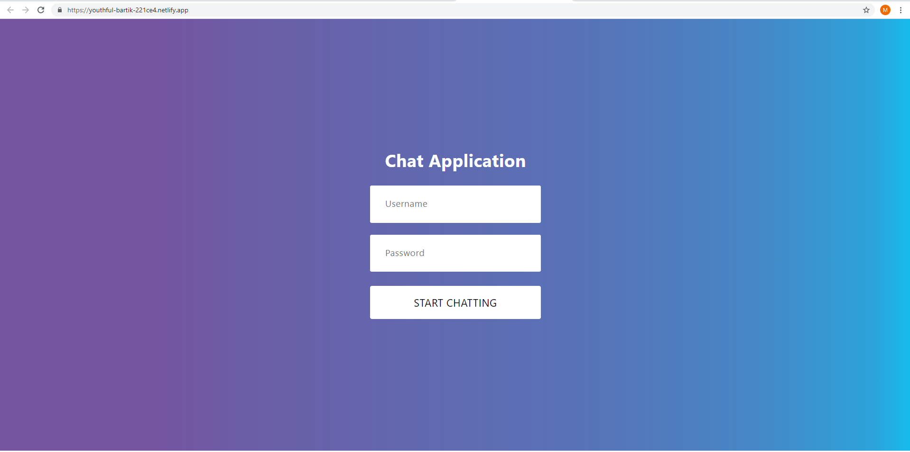
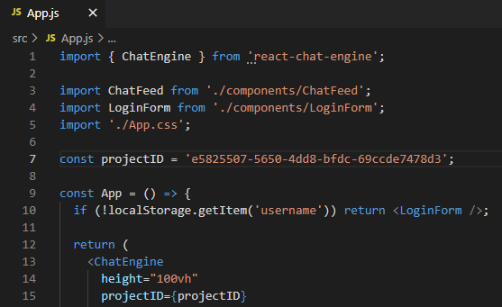
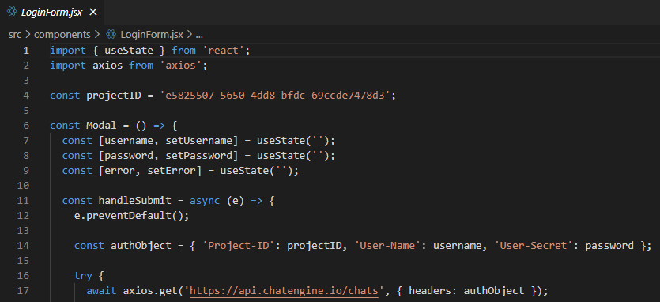

### React Chat Application
## [Live Chat App](https://youthful-bartik-221ce4.netlify.app/)

To build this site [chatengine.io](https://chatengine.io/) was used.

This app can send and receive text and photo messages, display read receipts, show when someone is typing and show if users are on or offline.
Login credentials and new chats and users must be created through Chat Engine.
More features such as a logout function and delete abilities will be added to the site in the future.

To test the site you may use `testuser` as the username and password [Login](https://youthful-bartik-221ce4.netlify.app)

To run the app in developement mode
### `npm start`
Open [http://localhost:3000](http://localhost:3000) to view it in the browser.

The page will reload if you make edits.
You will also see any linting errors in the console.

There are several places where you will need your Project ID from [chatengine.io](https://chatengine.io/)\
Your Project ID is found on the settings page of the project under API Keys.
It will be utilized in the App.js and LoginForm.jsx files

For the purpose of the demo it is okay to display the API key. Normally, it should be included as a secret.

### `npm run build`
Builds the app for production to the `build` folder.
